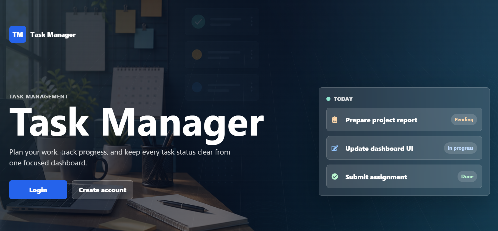

# MERN Task Manager

A full-stack task management application built with the MERN stack. Users can register, log in, create tasks, update tasks, delete tasks, toggle task status, search tasks, filter tasks, and view paginated task lists.

## Links

- GitHub Repository: https://github.com/Shreeram-Machak/mern-task-manager
- Vercel Live Frontend: https://mern-task-manager-i.vercel.app/
- Render Backend: https://mern-task-manager-rr7v.onrender.com

## Features

- User registration and login with JWT authentication
- Protected dashboard for authenticated users
- Create, read, update, and delete tasks
- Toggle tasks between pending and completed
- Search tasks by title or description
- Filter tasks by status
- Pagination for task lists
- Success and error alerts
- Clear empty state: "No tasks found"
- Responsive design for desktop and mobile

## Tech Stack

Frontend:
- React
- Vite
- React Router DOM
- Axios
- React Icons
- CSS

Backend:
- Node.js
- Express.js
- MongoDB
- Mongoose
- JWT
- bcryptjs

## Project Structure

```text
task-management-mern/
|
|-- backend/
|   |-- controllers/
|   |-- middleware/
|   |-- models/
|   |-- routes/
|   |-- server.js
|   |-- .env.example
|   `-- package.json
|
|-- frontend/
|   |-- public/
|   |-- src/
|   |-- .env.example
|   `-- package.json
|
|-- .gitignore
`-- README.md
```

## Backend Setup

1. Go to the backend folder:

```bash
cd backend
```

2. Install dependencies:

```bash
npm install
```

3. Create a `.env` file in the `backend` folder:

```env
PORT=5000
MONGO_URI=mongodb://localhost:27017/task-manager
JWT_SECRET=replace_with_a_secure_secret
```

For MongoDB Atlas, use your Atlas connection string for `MONGO_URI` and allow your IP address in Atlas Network Access.

4. Start the backend server:

```bash
npm run dev
```

Backend runs at:

```text
http://localhost:5000
```

## Frontend Setup

1. Go to the frontend folder:

```bash
cd frontend
```

2. Install dependencies:

```bash
npm install
```

3. Create a `.env` file in the `frontend` folder:

```env
VITE_API_URL=http://localhost:5000/api
```

4. Start the frontend development server:

```bash
npm run dev
```

Frontend usually runs at:

```text
http://localhost:5173
```

## Environment Variables

Backend `.env` example:

```env
PORT=5000
MONGO_URI=mongodb://localhost:27017/task-manager
JWT_SECRET=replace_with_a_secure_secret
```

Frontend `.env` example:

```env
VITE_API_URL=http://localhost:5000/api
```

## API Endpoints

### Authentication

| Method | Endpoint | Description |
| --- | --- | --- |
| POST | `/api/auth/register` | Register a new user |
| POST | `/api/auth/login` | Login user |

### Tasks

All task endpoints are protected and require a JWT token in the `Authorization` header.

| Method | Endpoint | Description |
| --- | --- | --- |
| GET | `/api/tasks` | Get all tasks |
| POST | `/api/tasks` | Create a task |
| PUT | `/api/tasks/:id` | Update a task |
| DELETE | `/api/tasks/:id` | Delete a task |
| PATCH | `/api/tasks/:id/toggle` | Toggle task status |

## Screenshots

Add the screenshots in a `screenshots` folder using these file names:

### Home Page



### Login Page


## Useful Scripts

Backend:

```bash
npm run dev
npm start
```

Frontend:

```bash
npm run dev
npm run build
npm run lint
npm run preview
```

## Future Improvements

- Dark mode
- Task categories
- Due dates
- Email notifications
- Drag and drop task management

## Author

Shreeram Machak
